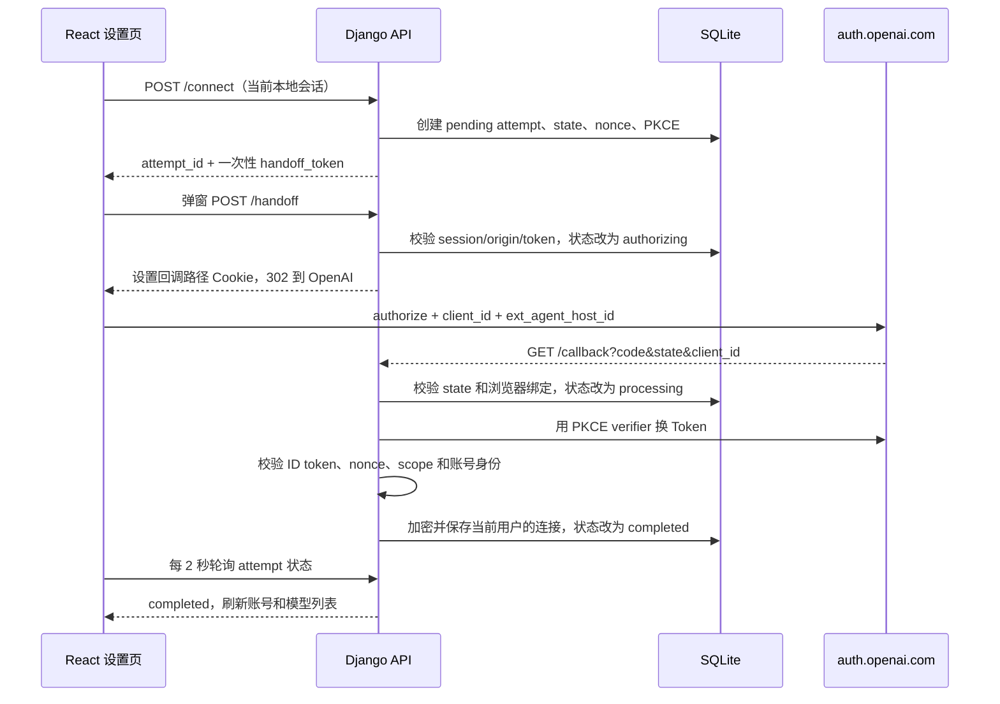

---
tags:
  - OAuth
  - OpenID-Connect
  - ChatGPT
  - Django
  - 项目案例
project: news-aggregator
updated: 2026-10-10
---

# News Aggregator：OpenAI OAuth 与 ChatGPT 订阅登录方案

## 结论先行

News Aggregator 使用 OpenAI 的开源应用 Sign in with ChatGPT 流程，让站内用户连接自己的 ChatGPT 订阅账号，并用获得的权限调用 Responses API。

下文描述的已实现流程是本地开源动态注册模式。公网多用户网站的接入要求、额度归属和待实施变更见“公网部署与多用户订阅额度”；不要将两种模式的 client ID 与回调规则混用。

这套方案最容易混淆的边界是：

| 对象 | 标识什么 | 本项目作用域 |
| --- | --- | --- |
| `agent_name_hint` | 应用的显示名称 | 固定为 News Aggregator |
| `ext_agent_host_id` | 应用实际运行的一个安装、机器或 VM | 每个部署一个，所有站内用户共享 |
| OpenAI 签发的 `client_id` | 某次 ChatGPT 用户与 Workspace 授权形成的注册 | 按站内用户的连接分别保存 |
| Access/refresh/ID token | 一次授权会话的凭据和身份声明 | 加密后按站内用户分别保存 |
| Django `User` | News Aggregator 本地账号 | 所有订阅查询和修改的授权边界 |

因此，`ext_agent_host_id` **不是订阅用户 ID，也不是登录一次就刷新一次的会话 ID**。同一部署应始终复用一个稳定 host ID；容器重启、代码更新或切换本地账号都不应改变它。不同机器或新 VM 是新的 host，应生成不同 ID。OpenAI 官方文档也把 host 定义为工具运行的环境，把 `client_id` 定义为用户授权的注册。

官方参考：

- [Overview：A client vs. an agent host](https://developers.openai.com/siwc/token-sharing-open-source)
- [Registration and sign-in](https://developers.openai.com/siwc/token-sharing-open-source/sign-in)
- [Accounts and sessions](https://developers.openai.com/siwc/token-sharing-open-source/profiles-and-sessions)

## 项目的数据边界

### 部署级 host

`backend/.runtime/chatgpt-deployment-id` 保存当前部署的非敏感 UUID。服务对它做摘要后查找或创建唯一的 `ChatGPTOAuthHost`，再把记录中的 `host_id` 作为 `ext_agent_host_id` 发送给 OpenAI。

相关代码：

- `backend/newsaggregator/settings.py:45-52`：加密密钥与部署标识配置。
- `backend/api/services/chatgpt_subscription.py:168-212`：原子创建部署标识并取得部署级 OAuth host。
- `backend/api/models.py:294-304`：`deployment_hash` 和 `host_id` 都唯一。
- `backend/api/migrations/0024_chatgpt_deployment_oauth_host.py`：把早期“每用户一个 host”收敛为“每部署一个 host”，优先保留已有用户 host；从旧 `ChatGPTOAuthClient` 升级时，在删除旧表前把原安装的 host ID 迁入部署记录，并取消旧的进行中请求。迁移不清除网站用户、管理员权限或已有连接凭据。

项目决策：

- 同一部署重启和升级时保留 `.runtime/chatgpt-deployment-id`。
- 新机器或新 VM 不复制该文件，让新部署产生自己的 host。
- 不把 email、本地用户 ID 或其他个人信息放进 host ID。
- host ID 不是密钥，但仍不应被当作用户身份或授权依据。

### 用户级连接

`ChatGPTSubscriptionConnection` 通过外键归属于 Django 用户，分别保存 `issued_client_id`、账号显示信息、授权范围、加密的 access/refresh/ID Token、模型选择及刷新状态。数据库约束保证同一用户的注册键不重复，并且最多只有一个活动连接。

相关代码：`backend/api/models.py:322-365`。

新建连接时使用 `client_id=dynamic_agent_client`；OpenAI 回调返回真正签发的 `client_id` 后才保存。对已有连接重新授权时复用该连接保存的 `client_id`，并携带同一连接加密保存的 `id_token_hint` 与已验证邮箱 `login_hint`。ID Token 即使过期也可作为返回账号提示，但每次回调仍必须重新验证新 ID Token。不能把 `dynamic_agent_client` 当成永久 client ID。

这实现了两个同时成立的目标：

1. 同一部署只有一个 host ID。
2. 不同 News Aggregator 用户的 client、Token、活动账号和模型选择互不共享。

2026-10-10 新增 [独立共享文章译文](shared-article-translations.md)：仅将完整的公开文章翻译结果复制到独立表，供其他读者复用。首位生成者承担模型用量；其他用户读取公共副本不调用模型。个人重新翻译保留在当前用户/连接的私有记录中，不覆盖已有公共版本；凭据隔离规则继续适用。

### 官方推荐的三个用户动作

| 操作 | OAuth 行为 | 本地行为 |
| --- | --- | --- |
| 重新授权已有账号 | 复用该连接的 `issued_client_id`、部署 host、`id_token_hint` 和 `login_hint` | 新授权完整验证成功后才原子替换旧凭据 |
| 连接其他账号 | 使用 `dynamic_agent_client` 和部署 host，不携带旧账号提示 | 验证后创建独立连接，不覆盖其他账号 |
| 撤销授权 | 用 refresh token 和该连接的 client ID 调用 revocation endpoint | 立即停止使用，临时网络/5xx 有界重试，随后清除 access/refresh/ID Token；保留 client/账号/host 映射，不自动重连 |

普通重授权不应先断开。否则 OpenAI 页面失败时会把原本可用的凭据提前丢失。真正的断开也不会、且不能清除浏览器里 `auth.openai.com` 的 Cookie；跨域浏览器状态需要用户在浏览器设置中处理。

2026-10-10 的交互决定：保留独立的“重新授权”和“撤销授权”，不提供“自动撤销并重连”。撤销完成后显示“已断开”，只刷新连接状态，不打开 OpenAI 窗口、不创建新的授权请求；以后用户明确点击“重新授权”才开始恢复登录。远端未确认撤销时，仍清除本地凭据并明确提示可到 ChatGPT 设置管理授权。撤销进行中暂停发起其他登录操作，避免本页两个动作交叠。

实现依据：`frontend/src/pages/ChatGPTSubscriptionSettings.tsx` 的 `disconnectMutation` 和账号卡片；回归测试分别覆盖远端确认和未确认两种结果，并断言不会调用连接 API 或打开授权窗口。

### 四种常见情况应该点击什么

| 情况 | 正确操作 | 结果 |
| --- | --- | --- |
| 从未连接过 ChatGPT 账号 | 点击“连接新账号” | 开始首次动态注册，验证成功后保存该用户的连接 |
| 已连接，想停止本站使用订阅 | 点击“撤销授权”；以后恢复原账号时点原卡片“重新授权” | 停止使用并清理本地凭据；撤销完成后不自动重连 |
| 当前已授权，想再次确认或恢复同一账号授权 | 直接点原卡片“重新授权”，无需先点击“连接新账号”或撤销 | 复用原注册和保留的账号提示，新授权成功后替换凭据 |
| 已撤销，想恢复原来的 ChatGPT 账号 | 手动点击原卡片“重新授权” | 复用保存的 client/账号映射，开始新的 OAuth 请求，不携带已清除的 ID Token |

“连接新账号”用于添加其他 ChatGPT 账号或新的注册。用它恢复原账号会走新增注册流程，可能出现重复连接；恢复已有账号应使用原卡片“重新授权”。

撤销后仍能手动发起重新授权，但此前该路径出现过 OpenAI 页面超时；保留这个入口不表示超时已解决。已实测成功的是“不先撤销、直接重新授权”的路径。

### 重授权与撤销后登录不是同一条路径

| 实际操作 | 本地 ID Token | 下一次授权的账号提示 | 浏览器 OpenAI Cookie |
| --- | --- | --- | --- |
| 成功连接后直接“重新授权” | 保留到新授权验证成功 | `id_token_hint` + 已验证邮箱 `login_hint` | 保留 |
| “断开并撤销”后“重新授权” | 已清除 | 只有已验证邮箱 `login_hint` | 保留；撤销 Token 不等于清 Cookie |
| 添加其他 ChatGPT 账号 | 不使用旧连接的 Token | 不携带旧账号提示 | 与同一浏览器配置文件共享 |
| 清 OpenAI 站点 Cookie 后授权 | 取决于是否另行断开本地连接 | 与本地连接的凭据状态有关 | 重新建立浏览器登录态 |

官方描述的预期返回登录行为是：带 `id_token_hint` 跳过账号选择；没有该提示时经过账号选择。该提示不代表有效登录会话，不能保证跳过密码验证，也不保证 OpenAI 端永不超时。

2026-10-10 的现场记录显示：同一注册先成功授权，用户明确执行“断开并撤销”后再次登录，OpenAI 页面出现 `Operation timed out`；失败 attempt 使用相同 client 和 host，只有 `login_hint`，停在 `authorizing` 且 `consumed_at` 为空。用户报告清 Cookie 后能成功。可以确认这是“撤销后重新登录”的复现，不能承诺清 Cookie 是永久修复。

随后完成一次实际对照验证（北京时间）：00:38:34 发起的恢复登录不带 ID Token 提示，最终 `completed`；00:39:34 发起的同一卡片重新授权同时带 `id_token_hint` 与 `login_hint`，也最终 `completed`。用户确认第二次没有先断开，也没有再清 Cookie。连接恢复为活动、可用状态，ID Token 已保留。这验证了普通重授权路径在本次测试中可用；“撤销后重新登录”的超时原因仍未定位到 OpenAI 的具体请求，不能由一次成功推导所有账号和登录场景都不会超时。

验收应分别测试两条路径：

1. 成功授权后不清 Cookie、不点断开，直接对同一卡片再做两次“重新授权”；确认请求带 `id_token_hint`，回调完成且身份一致。
2. 显式“断开并撤销”后保留 OpenAI Cookie，再重新授权；确认请求不带 ID Token，观察 OpenAI 账号选择和回调是否完成。
3. 若第二条失败，记录时间和失败阶段，再只清 OpenAI 的站点数据对照测试。不要更换 host/client 或反复新建注册来掩盖浏览器会话问题。

当前自动测试覆盖本地参数、凭据保留、身份验证和隔离；模拟测试不覆盖 OpenAI 的浏览器 Cookie、账号选择页面或内部会话恢复行为。不要把自动测试通过写成外部登录超时已彻底解决。

## 完整登录流程



前端先同步打开空白弹窗，避免浏览器把异步创建的窗口当成广告拦截；取得 handoff 信息后，在弹窗中提交一次性表单。原页面每两秒查询 attempt，只有进入 `completed`、`failed` 或 `cancelled` 才停止。实现位置：`frontend/src/pages/ChatGPTSubscriptionSettings.tsx:20-94`、`121-263`。

后端 handoff 会设置仅限回调路径的 HttpOnly Cookie，然后重定向到 OpenAI。回调必须同时匹配 OAuth `state` 和这个浏览器绑定 Cookie，防止另一个浏览器或被复制的 URL 接管授权。实现位置：`backend/api/subscription_views.py:61-90`、`116-141`，以及 `backend/api/services/chatgpt_subscription.py:302-340`、`463-488`。

## 公网部署与多用户订阅额度

> 状态：以下为待实施的公网适配方案。截至 2026-10-10，项目仍运行本地开源 OAuth 流程；已验证的本地重授权成功不代表公网接入已经获批或可用。

### 额度归属与应用标识

| 情况 | 额度归属 |
| --- | --- |
| 网站用户 A 连接 ChatGPT X，B 连接 ChatGPT Y | 分别使用 X、Y 的订阅额度 |
| 两个网站用户连接同一个 ChatGPT X | 共同消耗 X 的订阅额度，不因网站账号或注册数量增加额度 |
| 同一个 ChatGPT Plus 账号用于本网站和其他相关应用 | 五小时使用限额在这些应用间累计，不是每个应用各获一份 |
| 用户共用服务器或 host ID，但授权的是不同 ChatGPT 账号 | 不会仅因服务器或 host 相同而把订阅额度合并 |

当前代码通过 `active_connection_for_user(request.user)` 选取用户自己的连接，随后使用该连接的 access token 调用 Responses API；并未统一使用管理员订阅。依据：`backend/api/services/chatgpt_subscription.py:645-658`、`1133-1170`，`backend/api/views.py:938-966`。没有选择活动订阅时，部分功能仍走已有的服务端模型提供商配置；这属于另一条调用路径，不代表使用其他网站用户的 ChatGPT Token。

公网网站通常可以使用一个应用级 OAuth client ID 接收多个用户的授权。共享应用 client ID 与共享用户 Token 是两件事；用户的身份、Token 和连接仍须分开保存。当前本地动态注册中保存的“每次用户/Workspace 注册的 client ID”，不能直接当作正式网站获批的应用 client ID。

官方依据：[Accounts and sessions](https://developers.openai.com/siwc/token-sharing-open-source/profiles-and-sessions)、[On your website](https://developers.openai.com/siwc/website)。

### 三种接入场景不能混用

| 场景 | 官方路径 | 对本项目的含义 |
| --- | --- | --- |
| 用户在自己电脑运行开源应用 | 动态注册、loopback 回调 | 当前已实现的模式 |
| 用户把自己的开源实例运行在远程 VM | 本地完成 OAuth，经安全通道转移所选注册的凭据，VM 持久化自己的 host ID 并负责刷新 | 自托管部署路径，不等于公众网站的一键授权 |
| 一个公网网站服务多个访客 | 申请网站 OAuth 客户端；使用订阅还需确认 ChatGPT plan usage 接入资格 | 需要新增独立公网模式，不能只替换本地 URL |

OpenAI 的开源流程文档明确面向开源和本地托管应用，并将付费或远程托管应用引导到申请渠道。网站身份登录目前也通过指定合作方试用接入。应以获批后提供的客户端、回调、认证方式和授权范围为准。

来源：[开源流程适用范围](https://developers.openai.com/siwc/token-sharing-open-source)、[网站客户端申请入口](https://developers.openai.com/siwc/request-client-id)、[Self-hosted VMs](https://developers.openai.com/siwc/token-sharing-open-source/self-hosted-vms)。

### 身份登录不等于订阅调用权限

`openid profile email` 用于验证身份，不自动授予 AI 推理或订阅使用权限。申请时需明确 News Aggregator 的需求：多个网站用户分别授权自己的 ChatGPT 订阅，用于问答、推荐问题和全文翻译。

公网订阅调用的 scopes、resource、端点和 Token 使用方式须按 OpenAI 为该集成开通的契约实现。当前开源模式中的 `chatgpt.tokens.use.direct` 不能仅靠添加到网站登录 URL 就使一个身份客户端获得订阅权限。

官方依据：[Quickstart：Understand scopes](https://developers.openai.com/siwc/quickstart)。

### 推荐适配步骤

1. 确定正式 HTTPS 域名，申请网站客户端，并单独确认订阅使用资格。
2. 注册每个环境的完整回调地址，例如 `https://news.example.com/api/chatgpt-subscription/callback/`；这是示例地址，不是当前生效配置。
3. 将本地开源模式和公网网站模式明确区分。公网使用获批应用 client ID；本地继续使用原动态注册与注册映射。
4. 按配置的客户端认证方式进行 Token 兑换。只有 OpenAI 为客户端签发 secret 时才配置 secret，并仅存于服务端；刷新、撤销同样按该集成契约执行。
5. 每个 attempt 保存本次客户端、模式和准确的 redirect URI，换 Token 时复用该快照，避免部署变更或模式切换造成前后不一致。
6. 保留 state、nonce、PKCE、浏览器会话绑定、ID Token 验证和用户隔离；配置 HTTPS Cookie、明确的来源白名单与代理设置。
7. 获批后用真实公网环境完成下方验收，再开启订阅连接功能。申请和授权未完成前，配置域名本身不能使订阅接入可用。

### 当前代码需要适配的具体位置

| 文件/入口 | 当前状态 | 公网计划 |
| --- | --- | --- |
| `backend/api/services/chatgpt_subscription.py:48-55` | redirect、handoff 固定为本机，入口是 `dynamic_agent_client` | 增加模式、获批应用客户端与正式回调配置；host 参数是否发送按集成契约决定 |
| `create_authorization_attempt`、`_exchange_code` | 回调使用全局常量；首次动态注册期待 OpenAI 返回新 client ID | 保存 attempt 配置快照；公网使用预配置客户端，匹配已登记回调与客户端认证方法 |
| `backend/api/models.py:369` | attempt 已保存状态、会话绑定和请求客户端 | 增加模式/redirect 快照；旧本地连接不直接改造成网站注册，必要时分别重新授权 |
| `backend/api/subscription_views.py:81-89` | 浏览器绑定 Cookie 的 `secure=False` | HTTPS 部署启用 Secure，保留 HttpOnly、SameSite=Lax、明确路径与有效期 |
| `frontend/src/services/api.ts:326-337` | 只允许 `http://127.0.0.1:9527` handoff | 校验配置的网站来源、固定路径和协议；不接受任意后端 URL 或未经校验的 Host 拼接 |
| `backend/newsaggregator/settings.py:174-185` | CORS 全部放行，CSRF/授权来源主要为本机 | 配置正式域名、明确 CORS/CSRF/授权来源、Secure 会话 Cookie、可信代理 HTTPS 判断 |
| Token 与会话持久化 | 已按网站用户保存加密 Token，并用 lease 串行刷新 | 保留稳定密钥与隔离；多实例使用共享的持久化状态，不能依赖单进程内存保存授权事务 |

这张表是变更清单，不表示配置项和公网逻辑已经实现。也不应将开源动态注册的 loopback 回调直接改成任意 HTTPS 域名，假定 OpenAI 会接受。

### 公网验收要求

- 两个网站用户同时授权不同 ChatGPT 账号，回调各自绑定正确用户，请求分别使用正确 Token。
- 同一个网站应用 client ID 下，不同用户仍有独立的连接记录、活动选择和模型设置。
- A 重授权或断开时，B 的本地凭据和调用不被覆盖；若两人使用同一订阅账号，额度仍归同一账号累计。
- 回调缺少、过期、已使用或不匹配的 state，以及错误浏览器绑定、身份不一致的结果，均被拒绝。
- 授权期间切换网站登录用户、部署切换配置或多实例处理时，不会把旧结果写给其他用户。
- 实测 HTTPS 回调、Cookie、CSRF、代理重定向，以及刷新、撤销与额度不足提示；自动模拟测试不替代外部集成验收。

## 安全控制

### OAuth/OIDC 防护

- 每次 attempt 生成新的 `state`、OIDC `nonce` 和 PKCE verifier。
- 数据库只保存 `state`、nonce、handoff token 和浏览器绑定值的摘要。
- PKCE verifier 与完整授权 URL 加密保存。
- attempt 默认十分钟过期，并且 handoff、state 都只能消费一次。
- callback 校验 ID token 签名、issuer、audience、时间声明、nonce 和 `sub`。
- 必须包含 `chatgpt.tokens.use.direct`，否则不保存连接。

来源：`backend/api/services/chatgpt_subscription.py:47-60`、`234-378`、`381-460`、`510-626`。

### 本地用户隔离

- 所有连接读取和修改都用 `user=<当前用户>` 过滤。
- 发起重连时验证目标连接属于当前用户。
- 本地登录会话变化会取消进行中的授权。
- 前端 query key 包含本地用户 ID，切换用户时关闭旧弹窗并停止旧请求。
- 事务、generation fence 和行锁避免旧授权覆盖后来选择的连接。

来源：`backend/api/services/chatgpt_subscription.py:234-278`、`556-618`、`629-666`，`frontend/src/pages/ChatGPTSubscriptionSettings.tsx:43-94`、`163-178`。

### Token 存储和刷新

Access、refresh 和 ID Token 使用从 `CHATGPT_TOKEN_ENCRYPTION_KEY` 派生的 AES-GCM 密钥加密；没有单独配置时，只回退到显式设置的稳定 `DJANGO_SECRET_KEY`。迁移数据库时必须保留原密钥，否则旧 Token 无法解密。

刷新流程使用数据库 lease 和 credential generation，避免并发请求用同一个旋转 refresh token 互相覆盖。`invalid_grant` 或权限丢失会把连接标为 `needs_reauth`。断开操作先用 generation fence 停止该连接，再尝试撤销 renewable session；网络异常和 `5xx` 会有界重试，最后无论远端是否确认都清除本地三类 Token 并把结果告知用户。

不要把 Token、PKCE verifier、含 `id_token_hint` 的授权 URL 或环境密钥写进日志、文档、Git 或浏览器存储。

## 授权状态与故障定位

`ChatGPTAuthAttempt` 是定位问题的关键。状态含义如下：

| 状态 | 含义 | 优先检查 |
| --- | --- | --- |
| `pending` | 后端已创建请求，handoff 尚未成功消费 | 弹窗拦截、前端 POST、session/origin |
| `authorizing` | 已跳转到 OpenAI，尚未收到 callback | OpenAI 登录、账号选择、Cloudflare、网络 |
| `processing` | callback 已到本地，正在换 Token 或验证 | token endpoint、PKCE、ID token、scope |
| `completed` | Token 已验证并保存 | 前端轮询和缓存刷新 |
| `failed` | 本地处理失败或请求过期 | `status_message` 和后端日志 |
| `cancelled` | 用户取消、会话切换或新请求取代旧请求 | 是否误点取消、是否同时打开多个请求 |

模型位置：`backend/api/models.py:368-400`；过期和状态查询：`backend/api/services/chatgpt_subscription.py:343-378`。

### “密码提交后一直转圈”的判断方法

如果同时满足：

- 浏览器仍停在 `auth.openai.com`；
- 页面进入 Cloudflare“正在进行安全验证”或 Ray ID 不断变化；
- attempt 仍是 `authorizing`；
- `consumed_at` 为空；
- 本地没有收到 `/callback/`；

那么授权尚未进入本地回调，Token 兑换和解密还没有开始。应同时检查 OpenAI 页面、浏览器登录态、网络以及本地发出的授权参数；仅凭 `authorizing` 不能排除参数问题，也不能确定是 Cloudflare。跨域限制意味着父页面无法直接读取 OpenAI 弹窗里的具体错误，只能等待 callback、用户取消或 attempt 过期。设置页会提示尚未收到授权结果，OpenAI 页面已报错时可显式取消本次等待。

恢复步骤：

1. 在原设置页取消当前请求，避免并行创建多个授权请求。
2. 已有连接使用该卡片“重新授权”；普通重授权不先断开。先确认是保留 ID Token 的重授权，还是撤销后的重新登录。
3. 用户已复现清 Cookie 后恢复时，可只清 `auth.openai.com`、`chatgpt.com` 的站点数据进行对照；无痕窗口也必须新建，因为同一次无痕会话中的多个窗口共享登录态。这是恢复或诊断步骤，不是每次登录的要求。
4. 若用无痕窗口，必须在该窗口重新打开本地应用、登录本地账号并重新发起连接；不要只复制 OAuth URL，因为回调需要同一浏览器会话的绑定 Cookie。
5. 干净浏览器会话仍失败时，再检查扩展、代理与出口网络。不要在尚无证据时直接断定 IP 风控。
6. 请求超过十分钟后重新发起，不要继续使用旧授权页。OpenAI 错误页上的“重试”不代表生成了新的本地 attempt。

### 本地 500 与 OpenAI 超时要分开

修改 Django 模型并应用迁移后，Waitress 不会热重载。若数据库表已经变化而旧进程仍缓存旧模型，`/connect/` 会本地返回 500；这时需要重启 `app` 容器。单纯创建超级管理员不会要求重启。

```bash
docker compose exec -T app python backend/manage.py migrate
docker compose restart app
docker compose exec -T app python backend/manage.py check
docker compose ps app
```

## 运维检查清单

```bash
# 每个部署应只有一个 OAuth host
docker compose exec -T app python backend/manage.py shell -c \
  "from api.models import ChatGPTOAuthHost; print(ChatGPTOAuthHost.objects.count())"

# 查看最近 attempt 的阶段，不输出 Token 或完整授权 URL
docker compose exec -T app python backend/manage.py shell -c \
  "from api.models import ChatGPTAuthAttempt; print(list(ChatGPTAuthAttempt.objects.order_by('-created_at').values_list('user__username','status','status_message','consumed_at')[:5]))"

# 查看后端错误
docker compose logs --tail=200 app

# 订阅流程回归测试
docker compose exec -T app pytest -q backend/api/tests/test_chatgpt_subscription.py
```

数据库存在于宿主机挂载的 `backend/db.sqlite3`，切 Git 分支不会自动迁移或删除挂载数据。排查“用户丢失”时先确认 Compose 实际挂载路径、当前数据库文件、WAL/SHM 和迁移状态，不要用仓库中另一个 SQLite 文件覆盖运行数据。

## 常见错误设计

- 按本地用户生成 `ext_agent_host_id`：混淆了运行环境和订阅身份。
- 每次登录刷新 host ID：会把同一部署伪装成不断新增的 host。
- 所有部署共用同一 host ID：丢失机器/VM 的运行边界。
- 把一个用户的 Token 复制给另一个用户：破坏本地授权隔离。
- 新建连接后仍永久使用 `dynamic_agent_client`：首次回调后应保存签发的 `client_id`。
- 把 OAuth URL复制到另一个浏览器配置文件：callback 缺少原浏览器绑定 Cookie。
- 看到父页面“等待授权”就判断后端超时：先用 attempt 状态区分外部授权和本地处理阶段。
- 只迁移数据库、不迁移稳定加密密钥：旧 Token 将无法解密。

## 当前实现的限制与后续改进

- 应用无法绕过或自动完成 OpenAI/Cloudflare 的安全验证。
- 应用受浏览器同源策略限制，无法在“断开”时自动清除 `auth.openai.com` 或 `chatgpt.com` 的 Cookie。
- 因为弹窗跨域，前端不能直接识别 OpenAI 页面上的 `Operation timed out`；当前通过十分钟 TTL、状态轮询和人工取消收敛。
- 可增加“OpenAI 页面长时间未返回”的分阶段提示，但提示只能基于时间推断，不能宣称已识别 Cloudflare 错误。
- 已有连接的普通重授权会复用 `issued_client_id` 并发送保留的登录提示；真正断开后 ID Token 已清除，只发送已验证邮箱 `login_hint`。
