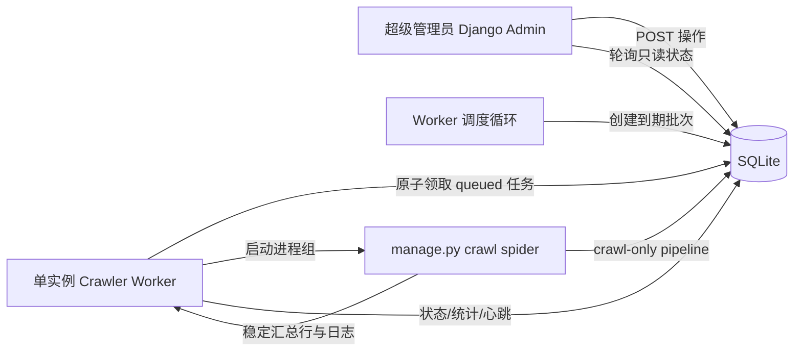

# 爬虫管理后台与 Docker 调度设计

## 1. 目标与假设

目标用户是维护 NewsHub 单机实例的超级管理员。主要任务是确认自动抓取正常、控制来源、立即执行、停止异常任务，并从历史记录定位失败原因。

本方案是可直接开发的交付设计，默认：

- Django Admin 是控制入口，不新增一套公开管理前端。
- 整个 `/admin/` 只允许已激活的超级管理员访问。
- Docker 部署自动运行独立爬虫 Worker。
- 首版保持单个爬虫并发，延续当前保守抓取策略。
- 所有计划任务保持 `NEWS_CRAWL_ONLY=1`，不触发翻译、向量化或其他 AI 调用。

## 2. 当前基线

- `backend/api/admin.py` 只注册了 Category、Source 和 News。
- Django Admin 默认允许具有 `is_staff` 的账号进入，不满足超级管理员专属要求。
- 当前数据库没有 staff 或 superuser 账号，需要部署者显式创建第一个超级管理员。
- `manage.py crawl` 有固定的 Spider 白名单，支持单来源或 `all`，并输出稳定的逐来源汇总。
- `scripts/news-cron` 使用 PID、日志文件和 `flock` 管理宿主机定时任务，状态没有进入数据库。
- Docker Compose 只运行 Web 服务；宿主机 timer 已禁用，因此当前 Docker 部署不会自动抓取。

## 3. 产品范围

### 3.1 首版包含

- 开启或暂停自动调度。
- 设置全局抓取间隔和“Worker 启动后立即运行”。
- 单独启用或停用每个 Spider。
- 手动运行全部或单个 Spider。
- 查看排队、运行、成功、失败、取消和跳过状态。
- 查看每个来源的 items、responses、errors、HTTP 状态分布、耗时和安全日志摘要。
- 对失败任务显式重试。
- 请求取消排队或正在执行的任务。
- Worker 心跳、下次执行时间和最近一次批次结果。
- Docker 自动启动 Worker，容器重启后恢复队列状态。

### 3.2 首版不包含

- 在后台输入任意 Scrapy 参数、Python 模块或 shell 命令。
- 多节点并行调度和分布式队列。
- 自动调用翻译、摘要、全文抓取或向量化。
- 普通用户或普通 staff 的只读访问。
- 在管理后台编辑 Spider 代码。

## 4. 信息架构

```text
管理后台
├── 爬虫控制台
│   ├── 调度状态与 Worker 心跳
│   ├── 当前任务 / 排队任务
│   ├── 立即抓取全部
│   └── 最近批次概览
├── 爬虫来源
│   ├── 启用 / 停用
│   ├── 立即运行
│   └── 最近结果
├── 抓取批次
│   ├── 批次汇总
│   └── 批次内来源结果
└── 抓取任务
    ├── 状态与统计
    ├── 安全日志摘要
    ├── 取消
    └── 重试
```

## 5. 控制台布局

```text
┌──────────────────────────────────────────────────────────────┐
│ 爬虫控制台                         Worker: 正常 · 12 秒前心跳 │
├──────────────────────────────────────────────────────────────┤
│ 自动调度：运行中    每 60 分钟    下次：17:00               │
│ [暂停调度] [立即抓取全部] [刷新状态]                         │
├──────────────────────────────────────────────────────────────┤
│ 当前任务                                                     │
│ Hacker News · 运行 01:42 · responses 31 · items 28 [请求停止]│
├──────────────────────────────────────────────────────────────┤
│ 来源             状态       最近结果      下次       操作     │
│ Hacker News      已启用     成功 28 条     17:00     [运行]   │
│ Reuters          已启用     HTTP 403       17:00     [重试]   │
│ Product Hunt     已停用     —              —         [启用]   │
├──────────────────────────────────────────────────────────────┤
│ 最近批次：成功 27 / 失败 3 / 取消 0 · 查看完整结果            │
└──────────────────────────────────────────────────────────────┘
```

交互规则：

- “暂停调度”只停止创建新任务，不中断当前任务。
- “请求停止”必须二次确认，Worker 收到后终止当前 Spider 子进程。
- 重复点击“运行”返回现有排队或运行任务，不创建重复任务。
- “立即抓取全部”只为已启用来源创建任务，并显示预计任务数量。
- 所有写操作使用 POST、CSRF 和 Django messages 反馈。
- 状态页面每 5 秒轮询；页面隐藏后停止轮询。

## 6. 数据模型

### CrawlerSettings（单例）

| 字段 | 说明 |
| --- | --- |
| `scheduler_enabled` | 是否创建新的定时批次 |
| `interval_seconds` | 全局间隔，默认读取 `CRAWL_INTERVAL_SECONDS` |
| `run_on_worker_start` | Worker 启动时是否补一次任务 |
| `next_run_at` | 下次计划时间 |
| `worker_heartbeat_at` | Worker 最近心跳 |
| `worker_instance_id` | 当前 Worker 实例标识 |
| `updated_by` | 最近修改设置的超级管理员 |
| `updated_at` | 最近修改时间 |

首版将最大并发固定为 1，不在界面提供调高入口。

### CrawlerTarget

| 字段 | 说明 |
| --- | --- |
| `spider_name` | 主键，必须来自代码内 `SPIDERS` 白名单 |
| `display_name` | 后台展示名称 |
| `enabled` | 是否加入定时批次 |
| `sort_order` | 稳定执行顺序 |
| `last_status` | 最近状态快照 |
| `last_started_at` / `last_finished_at` | 最近时间 |
| `last_items` / `last_responses` / `last_errors` | 最近统计 |
| `last_safe_error` | 脱敏后的最近错误 |

Worker 启动时以代码注册表为准同步目标；数据库不能创建任意 Spider 名称。

### CrawlBatch

| 字段 | 说明 |
| --- | --- |
| `id` | UUID |
| `trigger` | `scheduled` / `startup` / `manual` / `retry` |
| `status` | `queued` / `running` / `succeeded` / `partial` / `failed` / `cancelled` |
| `requested_by` | 手动操作的超级管理员，可为空 |
| `queued_at` / `started_at` / `finished_at` | 生命周期 |
| `total` / `succeeded` / `failed` / `cancelled` | 汇总计数 |

### CrawlRun

| 字段 | 说明 |
| --- | --- |
| `id` | UUID |
| `batch` | 所属批次 |
| `target` | 对应 CrawlerTarget |
| `status` | `queued` / `running` / `succeeded` / `failed` / `cancel_requested` / `cancelled` / `skipped` |
| `requested_by` | 操作者，可为空 |
| `queued_at` / `started_at` / `heartbeat_at` / `finished_at` | 生命周期 |
| `exit_code` | 子进程退出码 |
| `items` / `responses` / `errors` | Scrapy 汇总 |
| `http_statuses` | JSON 状态码计数 |
| `stats` | 经过白名单筛选的 Scrapy stats |
| `safe_error` | 脱敏、截断后的错误摘要 |
| `log_path` | 位于持久化 logs 目录的相对路径 |
| `retry_of` | 原失败任务，可为空 |
| `cancel_requested_by` / `cancel_requested_at` | 取消审计 |

数据库增加条件唯一约束：同一 Target 同时最多存在一个 `queued/running/cancel_requested` 任务。

## 7. 执行架构



### Worker 规则

1. 新增 `crawl_worker` management command，常驻轮询数据库。
2. Worker 使用持久化文件锁保证同一部署只有一个调度执行者。
3. 每个 Spider 在独立子进程和进程组中运行，避免 Twisted reactor 重启问题。
4. 子进程固定设置 `NEWS_CRAWL_ONLY=1` 和 `PYTHONUNBUFFERED=1`。
5. 解析现有 `爬虫汇总 source=...` 输出，并只保存允许的统计字段。
6. 取消时先发送 SIGTERM，等待宽限期后再发送 SIGKILL，并记录最终状态。
7. Worker 意外重启时，将超过心跳阈值的 running 任务标为 failed；不会自动重复产生抓取。
8. 定时窗口错过时最多补一个批次，避免容器离线后形成追赶风暴。
9. 日志按 Run ID 写入 `logs/crawler/`，数据库只保存尾部摘要和相对路径。

## 8. Docker 设计

Compose 增加 `crawler` 服务，复用同一镜像和持久化数据库：

```yaml
crawler:
  build:
    context: .
  command: ["python", "backend/manage.py", "crawl_worker"]
  env_file:
    - path: .env
      required: false
  environment:
    NEWS_CRAWL_ONLY: "1"
  volumes:
    - ./backend:/app/backend
    - ./logs:/app/logs
  depends_on:
    app:
      condition: service_healthy
  init: true
  restart: unless-stopped
  stop_grace_period: 45s
```

Web 和 Worker 共享 SQLite；首版单并发减少写锁竞争。`app` 健康后 Worker 才启动，数据库迁移仍由 Web entrypoint 完成。Worker 健康检查读取数据库心跳。

## 9. 超级管理员安全边界

- 使用自定义 `AdminSite`，`has_permission()` 必须同时满足 `is_active` 和 `is_superuser`。
- 普通 staff 账号不能进入 Admin 首页、模型列表或自定义爬虫视图。
- 所有控制操作再次检查 `request.user.is_superuser`，仅接受 POST，并保持 CSRF 校验。
- Spider 名称只从服务器注册表选择，不接受命令、模块路径、URL 或额外参数输入。
- 日志和错误只保留白名单统计、异常类型及脱敏摘要，不展示环境变量或请求凭据。
- 手动运行、取消、重试、调度设置变更均记录操作者和时间，并写入 Django admin LogEntry。
- ChatGPT 令牌模型不注册到 Admin；爬虫后台不读取或显示订阅凭据。

当前数据库没有超级管理员。上线该功能前由实例所有者显式创建：

```bash
docker compose exec app python backend/manage.py createsuperuser
```

创建账号属于单独的凭据操作，不在迁移或容器启动时自动完成。

## 10. 失败与恢复体验

| 场景 | 后台表现 | 系统行为 |
| --- | --- | --- |
| Worker 无心跳 | 红色“Worker 离线” | 不接受“运行中”假象，排队任务保留 |
| 来源正在运行 | 运行按钮禁用并链接当前任务 | 不重复创建 |
| HTTP 403/429 | 来源行显示状态码和安全摘要 | 任务失败，等待下次计划或人工重试 |
| 数据库锁繁忙 | 显示数据库繁忙 | 有限退避，不并发复制任务 |
| 容器重启 | 旧 running 标为中断失败 | 队列保留，管理员显式重试 |
| 请求取消 | 显示“停止请求已发送” | Worker 终止子进程并记录取消 |
| 暂停调度 | 顶部黄色状态 | 当前任务继续，停止创建新批次 |

## 11. 实施拆分

### 阶段 A：权限与持久化基础

- 自定义 superuser-only AdminSite。
- 新增四个模型、迁移、Spider 注册表同步服务。
- 注册只读历史页和基础筛选。
- 迁移后默认调度关闭，避免 Worker 尚未部署时产生排队任务。

### 阶段 B：Worker 与 Docker 自动抓取

- 实现数据库队列、调度循环、单实例锁、子进程执行、取消和恢复。
- Compose 增加 crawler 服务和 logs 挂载。
- 保持 crawl-only，复用当前保守速率与稳定汇总。
- 部署时确认宿主机 systemd timer 保持 disabled，避免双调度器。

### 阶段 C：后台控制台

- 自定义控制台、状态卡、来源表、批次与任务详情。
- 增加运行全部、单来源运行、暂停、取消、重试及确认流程。
- 增加安全日志摘要、轮询和无障碍状态提示。

### 阶段 D：验收与运维文档

- 权限、幂等排队、取消、重启恢复和 crawl-only 自动化验证。
- Docker 构建、健康、数据库持久化和真实单来源抓取验收。
- 更新 README、startup 文档和故障排查。

## 12. 验收标准

### 权限

- 匿名用户访问 `/admin/` 只进入登录流程。
- 普通 staff 登录后不能访问任何 Admin 页面或爬虫 URL。
- 只有 active superuser 能查看和操作控制台。
- 所有变更请求均验证 POST、CSRF 和 superuser。

### 调度与执行

- `docker compose up -d --build --wait` 后 Web 与 crawler 均健康。
- 调度启用后按设置间隔创建批次，停用来源不会入队。
- 同一来源不会出现重叠任务；全局同时最多运行一个 Spider。
- 手动运行、取消和失败重试都有持久状态及审计信息。
- 容器重启后历史仍存在，过期 running 任务被明确标记为中断。
- 自动任务全程保持 crawl-only，新增新闻不会自动调用 AI。

### 可观察性

- 控制台显示 Worker 心跳、下次执行、当前任务和最近批次结果。
- 每个来源可查看 items、responses、errors、HTTP 状态和耗时。
- 日志不包含 `.env`、API Key、OAuth token 或上游正文。
- 数据库与日志在 `docker compose down/up` 后继续存在。

## 13. 发布顺序

1. 备份 SQLite，并确认 quick_check 为 `ok`。
2. 合并阶段 A/B/C，构建新镜像。
3. 保持宿主机 timer disabled，启动 Web 和 crawler。
4. 创建首个超级管理员并登录 `/admin/`。
5. 先启用一个稳定来源进行真实抓取验收。
6. 验证数据库持久化、任务统计、取消和容器重启恢复。
7. 启用全部目标和每小时调度。
