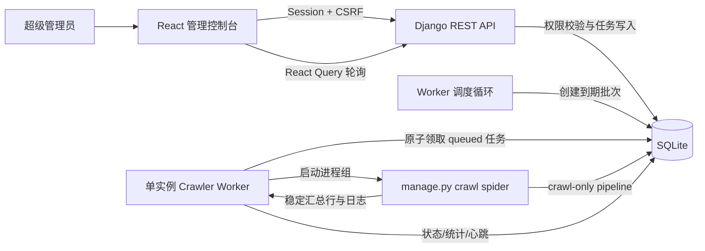

# 前端爬虫管理控制台与 Docker 调度设计

## 1. 产品方向

目标用户是维护 NewsHub 单机实例的超级管理员。主要任务是确认自动抓取正常、控制来源、立即执行、停止异常任务，并从历史记录定位失败原因。

本方案采用 NewsHub React 前端作为管理入口，Django 只提供鉴权、持久化和爬虫控制 API：

- 管理路由为 `/admin/crawlers`，使用现有前端设计系统，可继续客制化。
- 只有已登录的超级管理员可以看到入口、进入页面或调用控制 API。
- 前端权限判断只负责导航体验；Django API 始终执行真正的权限校验。
- Docker 部署自动运行独立爬虫 Worker。
- 首版保持单个爬虫并发，延续当前保守抓取策略。
- 所有计划任务保持 `NEWS_CRAWL_ONLY=1`，不触发翻译、向量化或其他 AI 调用。

## 2. 当前基线

- React Router 已承载新闻、搜索、设置等页面，适合增加独立的管理布局和懒加载路由。
- Header 的“管理后台”目前直接打开 Django `/admin`，无法复用 NewsHub 的视觉和交互体系。
- Django URL 当前优先占用 `admin/`，SPA fallback 也排除了该前缀；实施时必须移除 Django Admin 路由并让 `/admin/*` 返回 React `index.html`。
- 前端 `AuthUser` 和 `/api/auth/me/` 目前只返回 `id`、`username`，尚不能识别超级管理员。
- 后端使用 Django Session 和 CSRF，前端 Axios 已为写请求附带 CSRF Token。
- `manage.py crawl` 有固定的 Spider 白名单，支持单来源或 `all`，并输出稳定的逐来源汇总。
- `scripts/news-cron` 使用 PID、日志文件和 `flock` 管理宿主机定时任务，状态没有进入数据库。
- Docker Compose 只运行 Web 服务；宿主机 timer 已禁用，因此当前 Docker 部署不会自动抓取。
- 当前数据库没有 staff 或 superuser 账号，需要部署者显式创建第一个超级管理员。

## 3. 产品范围

### 3.1 首版包含

- 前端超级管理员专属管理布局和爬虫控制台。
- 开启或暂停自动调度。
- 设置全局抓取间隔和“Worker 启动后立即运行”。
- 单独启用或停用每个 Spider。
- 手动运行全部或单个 Spider。
- 查看排队、运行、成功、失败、取消和跳过状态。
- 查看每个来源的 items、responses、errors、HTTP 状态分布、耗时和安全日志摘要。
- 对失败任务显式重试。
- 请求取消排队或正在执行的任务。
- Worker 心跳、下次执行时间和最近一次批次结果。
- Docker 自动启动 Worker，容器重启后恢复队列状态。
- 手机、平板和桌面可用，状态变化具备文本和颜色双重提示。

### 3.2 首版不包含

- 在页面输入任意 Scrapy 参数、Python 模块或 shell 命令。
- 多节点并行调度和分布式队列。
- 自动调用翻译、摘要、全文抓取或向量化。
- 普通用户或普通 staff 的只读访问。
- 在管理页面编辑 Spider 代码。
- 把 Django Admin 作为日常爬虫控制入口。

## 4. 前端信息架构

```text
/admin
└── 管理布局
    ├── /admin/crawlers             爬虫控制台
    │   ├── 调度状态与 Worker 心跳
    │   ├── 当前任务 / 排队任务
    │   ├── 立即抓取全部
    │   └── 最近批次概览
    ├── /admin/crawlers/sources     爬虫来源
    │   ├── 启用 / 停用
    │   ├── 立即运行
    │   └── 最近结果
    ├── /admin/crawlers/batches     抓取批次
    │   ├── 批次汇总
    │   └── 批次内来源结果
    └── /admin/crawlers/runs/:id    抓取任务详情
        ├── 状态与统计
        ├── 安全日志摘要
        ├── 取消
        └── 重试
```

导航规则：

- 普通用户完全看不到“管理控制台”入口。
- 超级管理员登录后，Header 工具区显示站内链接“管理控制台”。
- `/admin` 重定向到 `/admin/crawlers`。
- 管理页面使用独立 `AdminLayout`，保留返回新闻站点的明确入口。
- 管理路由按需加载，不增加普通读者的首屏包体。
- Django URLConf 不再挂载 `admin.site.urls`，并从 SPA fallback 的排除规则中移除 `admin/`。

## 5. 控制台布局

```text
┌──────────────────────────────────────────────────────────────┐
│ NewsHub 管理控制台                         返回新闻站点       │
├───────────────┬──────────────────────────────────────────────┤
│ 爬虫控制台     │ Worker: 正常 · 12 秒前心跳                   │
│ 来源管理       ├──────────────────────────────────────────────┤
│ 抓取批次       │ 自动调度：运行中  每 60 分钟  下次：17:00   │
│               │ [暂停调度] [立即抓取全部] [刷新状态]          │
│               ├──────────────────────────────────────────────┤
│               │ 当前任务                                     │
│               │ Hacker News · 01:42 · 28 items [请求停止]     │
│               ├──────────────────────────────────────────────┤
│               │ 来源          最近结果       下次      操作   │
│               │ Hacker News   成功 28 条      17:00    [运行] │
│               │ Reuters       HTTP 403        17:00    [重试] │
│               │ Product Hunt  已停用          —        [启用] │
└───────────────┴──────────────────────────────────────────────┘
```

响应式规则：

- 桌面端使用侧栏和数据表；小屏改为顶部切换和来源卡片。
- 关键操作始终显示文字，图标只作为辅助。
- 状态使用徽标、文字和 `aria-live`，不能只依赖颜色。
- 长日志默认折叠，保留复制脱敏摘要的操作。

交互规则：

- “暂停调度”只停止创建新任务，不中断当前任务。
- “请求停止”必须二次确认，Worker 收到后终止当前 Spider 子进程。
- 重复点击“运行”返回现有排队或运行任务，不创建重复任务。
- “立即抓取全部”只为已启用来源创建任务，并显示预计任务数量。
- 所有写操作显示进行中状态并阻止重复提交。
- 状态查询使用 React Query；活动页面每 5 秒刷新，页面隐藏后暂停。
- 鉴权拒绝时重新读取登录态：会话失效则引导登录，非超级管理员显示无权访问；不会展示半成品控制台。

## 6. 前端组件与数据层

建议新增：

```text
frontend/src/pages/admin/CrawlerDashboard.tsx
frontend/src/pages/admin/CrawlerSourcesPage.tsx
frontend/src/pages/admin/CrawlBatchesPage.tsx
frontend/src/pages/admin/CrawlRunDetailPage.tsx
frontend/src/components/admin/AdminLayout.tsx
frontend/src/components/admin/SuperuserRoute.tsx
frontend/src/components/admin/WorkerStatusCard.tsx
frontend/src/components/admin/SchedulerControls.tsx
frontend/src/components/admin/ActiveRunCard.tsx
frontend/src/components/admin/CrawlerSourceTable.tsx
frontend/src/services/crawlerAdminApi.ts
frontend/src/services/crawlerAdminQueries.ts
frontend/src/types/crawlerAdmin.ts
```

`AuthUser` 增加 `isSuperuser: boolean`。只有后端明确返回 `true` 才视为超级管理员，缺失或其他值一律按无权限处理。

`SuperuserRoute` 的状态：

1. 鉴权加载中：显示页面级骨架屏。
2. 未登录：打开现有登录流程，成功后回到原管理 URL。
3. 已登录但不是超级管理员：渲染 403 页面并提供返回首页操作。
4. 超级管理员：渲染懒加载管理页面。

## 7. Django API 设计

Django 不负责渲染管理页面，只提供 `/api/admin/crawler/` 命名空间：

| 方法 | 路径 | 用途 |
| --- | --- | --- |
| `GET` | `/api/admin/crawler/dashboard/` | Worker、调度、当前任务和最近批次聚合数据 |
| `GET/PATCH` | `/api/admin/crawler/settings/` | 读取或修改调度设置 |
| `GET` | `/api/admin/crawler/targets/` | 来源状态、最近统计和启用状态 |
| `PATCH` | `/api/admin/crawler/targets/{name}/` | 启用或停用白名单来源 |
| `POST` | `/api/admin/crawler/batches/` | 创建全部或指定来源的手动批次 |
| `GET` | `/api/admin/crawler/batches/` | 分页查询批次历史 |
| `GET` | `/api/admin/crawler/batches/{id}/` | 批次及其来源运行结果 |
| `GET` | `/api/admin/crawler/runs/{id}/` | 单任务统计和安全日志摘要 |
| `POST` | `/api/admin/crawler/runs/{id}/cancel/` | 请求取消任务 |
| `POST` | `/api/admin/crawler/runs/{id}/retry/` | 为失败任务创建重试批次 |

API 规则：

- 新增 DRF `IsActiveSuperuser` permission，所有端点统一使用。
- 未登录或非超级管理员均由 DRF 拒绝访问；前端结合 `/api/auth/me/` 区分登录与权限状态。
- 写操作保持 Django Session、CSRF 和同源 Cookie 机制。
- 列表端点分页，过滤参数使用固定枚举。
- 写操作返回最新资源和稳定错误 `code`，方便前端恢复界面。
- 创建任务支持幂等键；同来源已有活动任务时返回该任务和 `already_active`。
- 错误响应只包含安全的 `code`、`message` 和字段错误，不回传命令、凭据或原始日志。
- `/api/auth/login/`、`/api/auth/register/` 和 `/api/auth/me/` 统一返回 `is_superuser`。

## 8. 持久化模型

### CrawlerSettings（单例）

| 字段 | 说明 |
| --- | --- |
| `scheduler_enabled` | 是否创建新的定时批次 |
| `interval_seconds` | 全局间隔，默认读取 `CRAWL_INTERVAL_SECONDS` |
| `run_on_worker_start` | Worker 启动时是否补一次任务 |
| `next_run_at` | 下次计划时间 |
| `worker_heartbeat_at` | Worker 最近心跳 |
| `worker_instance_id` | 当前 Worker 实例标识 |
| `updated_by` | 最近修改设置的超级管理员 |
| `updated_at` | 最近修改时间 |

首版将最大并发固定为 1，不在界面提供调高入口。

### CrawlerTarget

| 字段 | 说明 |
| --- | --- |
| `spider_name` | 主键，必须来自代码内 `SPIDERS` 白名单 |
| `display_name` | 前端展示名称 |
| `enabled` | 是否加入定时批次 |
| `sort_order` | 稳定执行顺序 |
| `last_status` | 最近状态快照 |
| `last_started_at` / `last_finished_at` | 最近时间 |
| `last_items` / `last_responses` / `last_errors` | 最近统计 |
| `last_safe_error` | 脱敏后的最近错误 |

Worker 启动时以代码注册表为准同步目标；数据库和 API 不能创建任意 Spider 名称。

### CrawlBatch

| 字段 | 说明 |
| --- | --- |
| `id` | UUID |
| `trigger` | `scheduled` / `startup` / `manual` / `retry` |
| `status` | `queued` / `running` / `succeeded` / `partial` / `failed` / `cancelled` |
| `requested_by` | 手动操作的超级管理员，可为空 |
| `queued_at` / `started_at` / `finished_at` | 生命周期 |
| `total` / `succeeded` / `failed` / `cancelled` | 汇总计数 |

### CrawlRun

| 字段 | 说明 |
| --- | --- |
| `id` | UUID |
| `batch` | 所属批次 |
| `target` | 对应 CrawlerTarget |
| `status` | `queued` / `running` / `succeeded` / `failed` / `cancel_requested` / `cancelled` / `skipped` |
| `requested_by` | 操作者，可为空 |
| `queued_at` / `started_at` / `heartbeat_at` / `finished_at` | 生命周期 |
| `exit_code` | 子进程退出码 |
| `items` / `responses` / `errors` | Scrapy 汇总 |
| `http_statuses` | JSON 状态码计数 |
| `stats` | 经过白名单筛选的 Scrapy stats |
| `safe_error` | 脱敏、截断后的错误摘要 |
| `log_path` | 位于持久化 logs 目录的相对路径 |
| `retry_of` | 原失败任务，可为空 |
| `cancel_requested_by` / `cancel_requested_at` | 取消审计 |

数据库增加条件唯一约束：同一 Target 同时最多存在一个 `queued/running/cancel_requested` 任务。

## 9. 执行架构



### Worker 规则

1. 新增 `crawl_worker` management command，常驻轮询数据库。
2. Worker 使用持久化文件锁保证同一部署只有一个调度执行者。
3. 每个 Spider 在独立子进程和进程组中运行，避免 Twisted reactor 重启问题。
4. 子进程固定设置 `NEWS_CRAWL_ONLY=1` 和 `PYTHONUNBUFFERED=1`。
5. 解析现有 `爬虫汇总 source=...` 输出，并只保存允许的统计字段。
6. 取消时先发送 SIGTERM，等待宽限期后再发送 SIGKILL，并记录最终状态。
7. Worker 意外重启时，将超过心跳阈值的 running 任务标为 failed；不会自动重复产生抓取。
8. 定时窗口错过时最多补一个批次，避免容器离线后形成追赶风暴。
9. 日志按 Run ID 写入 `logs/crawler/`，数据库只保存尾部摘要和相对路径。

## 10. Docker 设计

Compose 增加 `crawler` 服务，复用同一镜像和持久化数据库：

```yaml
crawler:
  build:
    context: .
  command: ["python", "backend/manage.py", "crawl_worker"]
  env_file:
    - path: .env
      required: false
  environment:
    NEWS_CRAWL_ONLY: "1"
    CRAWLER_SCHEDULER_ENABLED: "1"
  volumes:
    - ./backend:/app/backend
    - ./logs:/app/logs
  depends_on:
    app:
      condition: service_healthy
  init: true
  restart: unless-stopped
  stop_grace_period: 45s
```

Web 和 Worker 共享 SQLite；首版单并发减少写锁竞争。`app` 健康后 Worker 才启动，数据库迁移仍由 Web entrypoint 完成。Worker 健康检查读取数据库心跳。

## 11. 超级管理员安全边界

- Django API 的 `IsActiveSuperuser` 是最终权限边界，不能只依赖 React 路由或隐藏菜单。
- `auth/me` 返回权限标记只供前端渲染；修改响应、直接访问 URL 仍无法越过 API 权限。
- 所有控制操作仅接受规定方法，写操作保持 CSRF 校验。
- Spider 名称只从服务器注册表选择，不接受命令、模块路径、URL 或额外参数输入。
- 日志和错误只保留白名单统计、异常类型及脱敏摘要，不展示环境变量或请求凭据。
- 手动运行、取消、重试、调度设置变更均记录操作者和时间。
- ChatGPT 令牌不会出现在爬虫 API 或管理控制台。
- 本项目选择关闭 Django Admin HTTP 路由，让 `/admin/*` 专用于 React 管理控制台；数据维护继续通过受控 API 和 management command 完成。

当前数据库没有超级管理员。上线该功能前由实例所有者显式创建：

```bash
docker compose exec app python backend/manage.py createsuperuser
```

创建账号属于单独的凭据操作，不在迁移或容器启动时自动完成。

## 12. 失败与恢复体验

| 场景 | 前端表现 | 系统行为 |
| --- | --- | --- |
| Worker 无心跳 | 红色“Worker 离线” | 不接受“运行中”假象，排队任务保留 |
| 来源正在运行 | 运行按钮禁用并链接当前任务 | 不重复创建 |
| HTTP 403/429 | 来源行显示状态码和安全摘要 | 任务失败，等待下次计划或人工重试 |
| 数据库锁繁忙 | 显示数据库繁忙 | 有限退避，不并发复制任务 |
| 容器重启 | 旧 running 标为中断失败 | 队列保留，管理员显式重试 |
| 请求取消 | 显示“停止请求已发送” | Worker 终止子进程并记录取消 |
| 暂停调度 | 顶部黄色状态 | 当前任务继续，停止创建新批次 |
| 登录失效 | 保留当前管理 URL 并要求重新登录 | 登录成功后重新读取权限和数据 |

## 13. 实施拆分

### 阶段 A：API 权限与持久化基础

- 增加 `is_superuser` 登录态字段和 DRF `IsActiveSuperuser` 权限类。
- 移除 Django Admin URL，并让 `/admin/*` 使用 SPA fallback。
- 新增四个模型、迁移、Spider 注册表同步服务。
- 实现只读 dashboard、targets、batches、runs API。
- Docker 首次启动默认启用调度；非 Docker 环境可用 `CRAWLER_SCHEDULER_ENABLED=0` 关闭。

### 阶段 B：Worker 与 Docker 自动抓取

- 实现数据库队列、调度循环、单实例锁、子进程执行、取消和恢复。
- Compose 增加 crawler 服务和 logs 挂载。
- 保持 crawl-only，复用当前保守速率与稳定汇总。
- 部署时确认宿主机 systemd timer 保持 disabled，避免双调度器。

### 阶段 C：前端管理控制台

- 增加 `AdminLayout`、`SuperuserRoute` 和懒加载管理路由。
- 将 Header 的 Django Admin 外链替换为超级管理员专属站内入口。
- 实现控制台、来源、批次和任务详情页面。
- 增加运行全部、单来源运行、暂停、取消、重试及确认流程。
- 增加安全日志摘要、轮询、响应式布局和无障碍状态提示。

### 阶段 D：验收与运维文档

- 权限、幂等排队、取消、重启恢复和 crawl-only 自动化验证。
- Docker 构建、健康、数据库持久化和真实单来源抓取验收。
- 使用真实浏览器验收桌面端和移动端管理流程。
- 更新 README、startup 文档和故障排查。

## 14. 验收标准

### 权限

- 未登录访问 `/admin/crawlers` 时进入登录流程，并能在登录后回到原 URL。
- 普通用户和普通 staff 看不到入口，直接访问页面得到明确的 403 体验。
- 直接请求任意爬虫 API 时，普通用户和 staff 均返回 403。
- 只有 active superuser 能读取或修改爬虫状态。
- 所有写请求均验证 CSRF、请求方法和 superuser。

### 调度与执行

- `docker compose up -d --build --wait` 后 Web 与 crawler 均健康。
- 调度启用后按设置间隔创建批次，停用来源不会入队。
- 同一来源不会出现重叠任务；全局同时最多运行一个 Spider。
- 手动运行、取消和失败重试都有持久状态及审计信息。
- 容器重启后历史仍存在，过期 running 任务被明确标记为中断。
- 自动任务全程保持 crawl-only，新增新闻不会自动调用 AI。

### 前端体验与可观察性

- 管理路由不会进入普通读者的首屏 bundle。
- 桌面、窄屏和键盘操作均能完成调度、运行、取消与重试流程。
- 控制台显示 Worker 心跳、下次执行、当前任务和最近批次结果。
- 每个来源可查看 items、responses、errors、HTTP 状态和耗时。
- 状态刷新不会覆盖正在确认的用户操作，也不会重复创建任务。
- 日志不包含 `.env`、API Key、OAuth token 或上游正文。
- 数据库与日志在 `docker compose down/up` 后继续存在。

## 15. 发布顺序

1. 备份 SQLite，并确认 quick_check 为 `ok`。
2. 完成阶段 A/B，验证 API 权限和 Worker，再接入阶段 C 前端。
3. 保持宿主机 timer disabled，构建并启动 Web 和 crawler。
4. 由实例所有者创建首个超级管理员并登录前端管理控制台。
5. 先启用一个稳定来源进行真实抓取验收。
6. 验证数据库持久化、任务统计、取消和容器重启恢复。
7. 启用全部目标和每小时调度。
